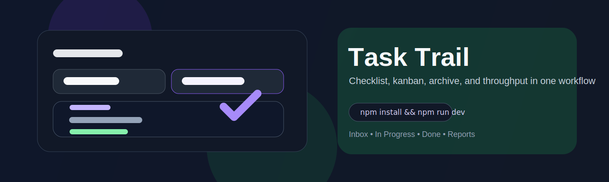

<p align="center">
  
</p>

<h1 align="center">Task Trail</h1>

<p align="center">
  Personal task manager with date-based checklists, kanban movement, archive recovery, and throughput reporting.
</p>

<p align="center">
  <a href="#installation"></a>
  <a href="#installation"></a>
  <a href="LICENSE"></a>
</p>

<p align="center">
  <code>npm install && npm run dev</code>
</p>

Task Trail keeps daily capture, status movement, archive lookup, and lightweight reporting in one workflow.

## At a Glance

- Date-based checklist flow with Inbox, In Progress, and Done states
- Kanban board and archive restore/search for moving between current and past work
- Throughput reporting plus optional AI parsing for turning free text into tasks

## Why Task Trail

- Daily work and longer-running tasks live in the same model
- Status history and reporting are built around actual execution flow, not just storage
- The app stays lightweight enough for personal use while still exposing useful review data

## Core Features

- Date-based task capture
- Custom statuses with seeded defaults
- Drag-and-drop kanban board
- Archived task search and restore
- 7-day / 30-day throughput reports
- Optional AI-assisted task parsing

## Installation

### Requirements

- Node.js 18+
- A Supabase project

### Local Setup

```bash
npm install
npm run dev
```

Open `http://localhost:3000`.

### Environment Variables

Create `.env.local`:

```bash
NEXT_PUBLIC_SUPABASE_URL=https://your-project.supabase.co
NEXT_PUBLIC_SUPABASE_ANON_KEY=your-anon-key
OPENAI_API_KEY=sk-your-openai-key
OPENAI_MODEL=gpt-4.1-mini
```

Leave `OPENAI_API_KEY` empty if you do not want AI parsing.

### Database Setup

Create the tables shown below in Supabase SQL Editor:

```sql
create table if not exists statuses (
  id uuid primary key default gen_random_uuid(),
  name text not null,
  "order" integer not null,
  created_at timestamptz not null default now()
);

create table if not exists tasks (
  id uuid primary key default gen_random_uuid(),
  title text not null,
  status_id uuid not null references statuses(id) on delete cascade,
  date text not null,
  "order" integer not null,
  started_at timestamptz,
  completed_at timestamptz,
  is_archived boolean not null default false,
  archived_at timestamptz,
  created_at timestamptz not null default now(),
  updated_at timestamptz not null default now()
);

create table if not exists task_status_history (
  id uuid primary key default gen_random_uuid(),
  task_id uuid not null references tasks(id) on delete cascade,
  from_status_id uuid references statuses(id),
  to_status_id uuid not null references statuses(id),
  changed_at timestamptz not null default now()
);
```

Optional archival automation is available in `supabase/migrations/20260125_archive_done_tasks.sql`.

## Usage

- Capture tasks for a specific day
- Move work across Inbox, In Progress, and Done
- Restore archived work when context returns
- Review recent throughput in the reports view
- Use AI parsing to turn rough notes into task candidates

## Deploy

```bash
npm run build
```

For Vercel, add the same environment variables used locally.

## Contributing

Before opening a PR:

```bash
npm run lint
npm run build
```

If AI parsing behavior changes, verify both the AI path and the fallback path.

Issue reports should include:

- Browser and OS
- Reproduction steps
- Expected vs actual behavior
- Relevant Supabase setup details with secrets removed

Recommended commit prefixes: `feat`, `fix`, `docs`, `refactor`, `test`, `chore`
